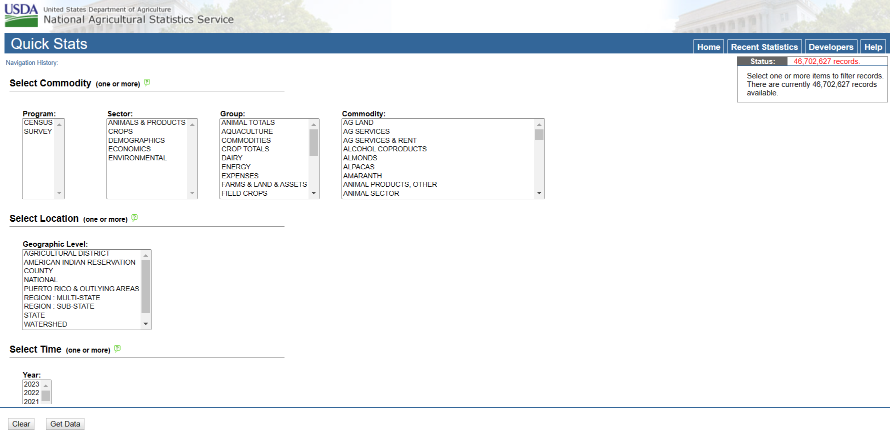
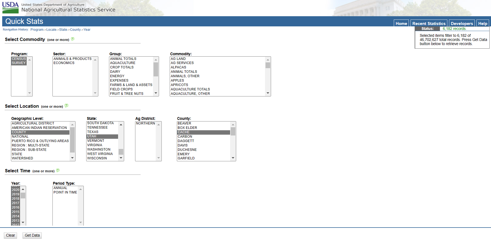
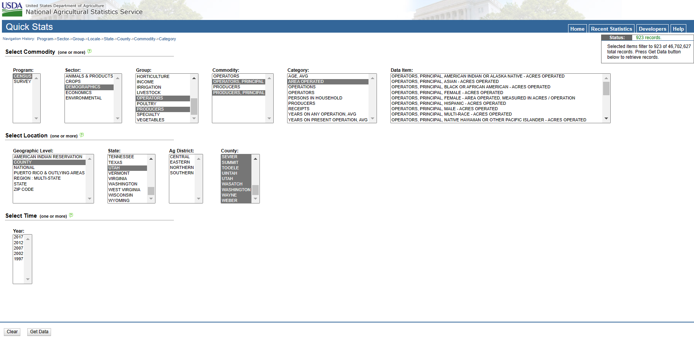

### Section 1: This document, in brief

In our paper, [*Implications of U.S. agricultural data practices for sustainable food systems research*](not yet published), we argue that "The USDA’s data infrastructure constricts knowledge discovery, innovation, and reimagination in U.S. agriculture." By *data infrastructure*, we refer primarily to the [NASS Quick Stats database](https://quickstats.nass.usda.gov/), the primary corpus of data through which researchers and the public can learn about U.S. agriculture.

This document is a companion to our paper, and has been built to demonstrate how a user might transform USDA NASS Census of Agriculture (CoA) and survey data from their original to **tidy** form.

 In what follows, we explore:
 
 1) What the Quick Stats database looks like and what we can ask of it;
 2) Querying the database to download all data for Cache County, UT from 2000-2022;
 3) Exploring the manually downloaded data; and,
 4) Building a *tidy* data product.


### Section 2: What does Quick Stats look like and what can we ask of it?

<center>



</center>


Above, you might notice the three-tiered filtering system used to navigate the database -- “what”, or "Select Commodity", “where” or "Select Location", and “when” or "Select Time". Each filter appears as a dropdown, or sets of dropdowns, such as sector (e.g., crops, demographics) or commodity (e.g., ag land, animal sector) in the “what” filter, and geographic level (e.g., state, county) in the “where” filter. 

Though Quick Stats does offer a table of [columns definitions](https://quickstats.nass.usda.gov/api/), the location of this metadata is hidden within the "Usage" page of the "Developers" tab, and the information itself is incomplete, not fully detailing: 1) how these hierarchies or variables correspond to CoA or survey questions; 2) what aggregation techniques were employed; or 3) what disclosure rules apply by variable and geography.

This makes it almost impossible for researchers to map data to questionnaires, to understand which data they have access to and why, or to easily navigate the data they download.

### Section 3: Querying the database to download all data for Cache County, UT from 2000-2022

First, we will explore the complex nature of the Quick Stats downloads,  manually querying the database for data from Cache County, UT in years 2000-2020 in both surveys and censuses.

<center>



</center>


This manual query results in 6,182 records -- when downloaded, these data arrive unattached to metadata of any kind -- failing to meet contemporary best practices for data management and stewardship, including the provisioning of *rich* metadata. The only download appearing in a users' downloads folder is a 1,242 KB .csv file with the following structure:

```{r}
cache <- read.csv("./data/cache.csv")

str(cache)
```

Though the columns, above, are detailed minimally in the definitions table linked in section 2, the various categories they contain are not detailed at all. Column 17, for instance, "Data.Item" includes 1442 unique categories; everything from "RASPBERRIES, (EXCL BLACK & RED) - ACRES NON-BEARING" to "COMMODITY TOTALS, INCL VALUE-ADDED, RETAIL, DIRECTLY MARKETED, HUMAN CONSUMPTION - OPERATIONS WITH SALES". Column 17 is not, however, the only column with many unique categories. Column 16 - "Commodity" has 153, Column 18 - "Domain" has 41, and Column 19 - "Domain.Category" has 256. 

For a researcher, or public data user for that matter, to find the data they are actually interested in, they must navigate these columns. To make matters more complicated, these columns are not independent, but nested and hierarchical.

### Section 4: Exploring the manually downloaded data

What do we mean by nested and hierarchical? Well, each successive column starting with column 16 acts as a filter for the columns that follow. If, for instance, a user filters for only data categorized as "AG LAND", they reduce their dataset from 6182 observations to 618 observations:

```{r message = FALSE, warning = FALSE}
library(tidyverse) # package used to tidy data

ag_land <- cache %>% filter(Commodity == "AG LAND")

str(ag_land)
```

This filtered dataset also limits the categories available in columns 17-19 to those included under the hierarchy "AG LAND". This category, again, is undefined by USDA NASS.

So what if we were only interested in data on female farmers? How might we filter for this data and build a tidy dataset?

First, let's discover which category within "Commodity" makes most sense to filter on:

```{r}
unique(cache$Commodity)
```

Notice, there are 153 categories in this column. Two of these looks promising: "OPERATORS, PRINCIPAL" & "OPERATORS". Let's filter on these:

```{r}
farmers <- cache %>% filter(Commodity %in% c("OPERATORS, PRINCIPAL", "OPERATORS"))

unique(farmers$Data.Item)
```

This filtered dataset has 271 observations. Still, there are 80 unique categories in the next hierarchy, "Data.Item". You might also notice that there are only 3 unique years in these data. What happened to our data dating back to 2000? Well, operator characteristics are only recorded in CoA years, and, starting with the 2022 CoA, no operator characteristics will again be disaggregated an available at the county level.

Now let's discover which category within "Data.Item" makes most sense to filter on. Categories, above, with "female" in the name are promising. There are 22 of these:
```{r}
female_farmers <- farmers %>% 
  filter(Data.Item %in% c("OPERATORS, PRINCIPAL, FEMALE - AGE, AVG, MEASURED IN YEARS", 
                          "OPERATORS, FEMALE - ACRES OPERATED",
                          "OPERATORS, FEMALE - NUMBER OF OPERATIONS",
                          "OPERATORS, FEMALE - NUMBER OF OPERATORS",
                          "OPERATORS, (ALL), FEMALE - NUMBER OF OPERATORS",
                          "OPERATORS, PRINCIPAL, FEMALE - ACRES OPERATED",
                          "OPERATORS, PRINCIPAL, FEMALE - AREA OPERATED, MEASURED IN ACRES / OPERATION",
                          "OPERATORS, PRINCIPAL, FEMALE - NUMBER OF OPERATIONS",
                          "OPERATORS, PRINCIPAL, FEMALE, AGE 35 TO 44 - NUMBER OF OPERATORS",
                          "OPERATORS, PRINCIPAL, FEMALE, AGE 45 TO 64 - NUMBER OF OPERATORS",
                          "OPERATORS, PRINCIPAL, FEMALE, AGE GE 65 - NUMBER OF OPERATORS",
                          "OPERATORS, PRINCIPAL, FEMALE, AGE LT 35 - NUMBER OF OPERATORS",
                          "OPERATORS, PRINCIPAL, FEMALE, DAYS WORKED OFF OPERATION, 0 DAYS - NUMBER OF OPERATORS",
                          "OPERATORS, PRINCIPAL, FEMALE, DAYS WORKED OFF OPERATION, GE 1 DAYS - NUMBER OF OPERATORS",
                          "OPERATORS, PRINCIPAL, FEMALE, PRIMARY OCCUPATION, (EXCL FARMING) - NUMBER OF OPERATORS",
                          "OPERATORS, PRINCIPAL, FEMALE, PRIMARY OCCUPATION, (EXCL FARMING) - OPERATIONS WITH RECEIPTS",
                          "OPERATORS, PRINCIPAL, FEMALE, PRIMARY OCCUPATION, FARMING - NUMBER OF OPERATORS",
                          "OPERATORS, PRINCIPAL, FEMALE, PRIMARY OCCUPATION, FARMING - OPERATIONS WITH RECEIPTS",
                          "OPERATORS, PRINCIPAL, FEMALE, YEARS ON PRESENT OPERATION, 3 TO 4 YEARS - NUMBER OF OPERATORS",
                          "OPERATORS, PRINCIPAL, FEMALE, YEARS ON PRESENT OPERATION, 5 TO 9 YEARS - NUMBER OF OPERATORS",
                          "OPERATORS, PRINCIPAL, FEMALE, YEARS ON PRESENT OPERATION, GE 10 YEARS - NUMBER OF OPERATORS",
                          "OPERATORS, PRINCIPAL, FEMALE, YEARS ON PRESENT OPERATION, LT 3 YEARS - NUMBER OF OPERATORS"))

str(female_farmers)
```

Now our dataset about female farmers in Cache County, UT has only 77 observation. There remain many more categories to explore: Tenure ("part owner", "full owner", "tenant"), Economic Class ("LESS THAN 2,500", "2,500 TO 9,999", "10,000 OR MORE"), and many cross-tabulations to uncover: acres operated by tenure class, farming as primary occupation by economic class. 

Getting to this point, where a data user or researcher can see the particular data items they are interested in, can begin connecting these data to spatial data or begin building graphics, is a tedious process full of best estimations and guesses as to what USDA NASS means by particular data items. Consider, too, that in this exercise we have explored one subset of operator-level data for one county -- what if a researcher was interested in building a panel of multiple variables across the coterminous US and wishes to connect this panel with spatial data for formal analyses? In this case, a clean and tidy dataset, where each column is a variable and each row an observation (county-year in this case), is preferable.

### Section 5: Building a *tidy* data product

In what follows, we will build a data set that includes County, Year, Number of Male Operated Acres, and Number of Female Operated Acres across all counties in Utah for the 1997-2012 CoAs. We will then derive the % Female operated acres.

First, we need to download demographic data for area operated by all operators/producers:

<center>



</center>

There are only a few columns we actually need from the following dataset, so let's first select for those:

```{r}
utah <- read.csv("./data/utah.csv")

utah <- utah %>% 
  select(Year, State, County, Commodity, Data.Item, Domain, Domain.Category, Value)
```

We are also only interested in Male and Female Operated Acres, so let's next filter for that:

```{r}
fm_acres <- utah %>% 
  filter(Data.Item %in% c("PRODUCERS, PRINCIPAL, FEMALE - ACRES OPERATED",
                          "PRODUCERS, PRINCIPAL, MALE - ACRES OPERATED",
                          "OPERATORS, PRINCIPAL, FEMALE - ACRES OPERATED",
                          "OPERATORS, PRINCIPAL, MALE - ACRES OPERATED"))

str(fm_acres)
```

Finally, we are not interested in seeing operatorship by tenure status, here, so let's finally filter tenure data out:

```{r}
fm_acres <- fm_acres %>% 
  filter(Domain.Category == "NOT SPECIFIED")
```

The USDA changed their definition from operator to producer in 2017. As we point out in [Burchfield et al., 2022](https://www.frontiersin.org/articles/10.3389/fsufs.2021.795901/full?&utm_source=Email_to_authors_&utm_medium=Email&utm_content=T1_11.5e1_author&utm_campaign=Email_publication&field=&journalName=Frontiers_in_Sustainable_Food_Systems&id=795901): "Direct comparisons between 2017 and other CoA years are complicated by changing definitions of farm operators/producers. In 2012, demographic information from up to three operators, and one designated principal operator were collected. In 2017, “operator” was replaced by “producer”, and the CoA, recognizing that multiple people may identify as principal operators, collected data on up to four producers, multiple of which may identify as principal producers. Prior to 2017 the principal operator (n = 1) self-identified, while in 2017, the principal operator equivalent, primary producer (n = 1) was chosen by designating either: (1) the person who makes the most decisions on the farm, or, if decisions are made equally, (2) the person who worked off the farm the least. Demographic data were not reported for primary producers in 2017, only for principal producers (n ≤ 4), thus, statistics for principal producers in 2017 are not directly comparable to any statistics in previous CoAs." 

Noting this as a caveat to our building this dataset, let's next make our categories uniform. 
```{r}
fm_acres <- fm_acres %>% 
  mutate(male_female = case_when(
    Data.Item == "PRODUCERS, PRINCIPAL, MALE - ACRES OPERATED" ~ "male_op_acres",
    Data.Item == "OPERATORS, PRINCIPAL, MALE - ACRES OPERATED" ~ "male_op_acres",
    Data.Item == "PRODUCERS, PRINCIPAL, FEMALE - ACRES OPERATED" ~ "female_op_acres",
    Data.Item == "OPERATORS, PRINCIPAL, FEMALE - ACRES OPERATED" ~ "female_op_acres"
  ))

str(fm_acres)
```

Now we have added a column that denotes whether the statistic reported in column 8, "Value", denotes acres operated by female or male principal producers. We can now delete the "Commodity", "Data.Item", "Domain", and "Domain.Category" columns, as these serve no purpose in our final dataset. To make this data tidy, each row must correspond to a county-year observation, and each column a variable. Thus, we need to spread our data from the "male_female" and "Value" columns, as follows:

```{r}
tidy <- fm_acres %>% 
  select(-c(Commodity, Data.Item, Domain, Domain.Category)) %>% 
  pivot_wider(names_from = male_female, values_from = Value)

str(tidy)
```

Our clean dataset has 5 columns and 145 observations, where each observation represents a county-year. There are 5 years in the dataset and 29 counties in Utah == 145 observations.

Interestingly, the data in the female_op_acres and male_op_acres columns arrived as character data. Let's change the type for each of these columns to numeric:

```{r}
tidy$female_op_acres <- as.numeric(gsub(",","",tidy$female_op_acres))
tidy$male_op_acres <- as.numeric(gsub(",","",tidy$male_op_acres))
```
Now, we can find the percent of agricultural land operated by female principal operators, our aim this whole time:

```{r}
tidy <- tidy %>% 
  mutate(perc_fem_op_acres = female_op_acres/(female_op_acres+male_op_acres)*100)

library(DT)
datatable(tidy)
```

Using the navigation at the top of the table, above, you can sort the columns based on county name and see the change in % female operatorship over time.

### Section 5: Conclusion, in brief

The aim of this document is to demonstrate how a user might transform USDA NASS Census of Agriculture (CoA) and survey data from their original to **tidy** form.

We explored: 1) What the Quick Stats database looks like and what we can ask of it; 2) Querying the database to download all data for Cache County, UT from 2000-2022; 3) Exploring the manually downloaded data; and, 4) Building a *tidy* data product, to reveal the complicated, nested, and hierarchical nature of data downloaded from NASSs Quick Stats database. Further, we publish this document with our paper, *Implications of U.S. agricultural data practices for sustainable food systems research*, to build a demonstrative case for improving the data architecture of USDA data dissemination platforms to increase ease of data access and transparency around current and changing data practices. 
 